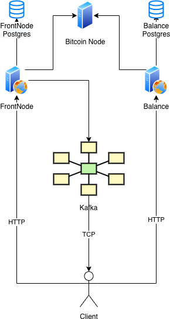
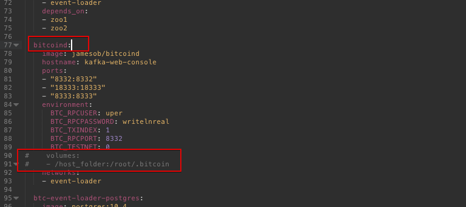

# FrontNode

**FrontNode** helps you to receive transaction events and check balance on the Bitcoin P2P network for a specific address in real time.

To track any Input/Output transactions and updates related to the specific addresses, register one or multiple addresses in FrontNode by running POST HTTP query and subscribe for Kafka endpoint. If the address will send or receive some transaction, it will trigger event.

Additionally, you can check address balance (if it is not a script) by running simple GET http query.


##### Below is project architecture diagram.



# How to install

Start from **docker-compose.yaml** file first.

To save your progress of sync and other data you should set volumes in all servers.

### Example:
**"bitcoind"** service line has: 

```
# volumes:
# /host_folder:/root/.bitcoin
```
you should modify it to: 

```
volumes:
~/btc_node_dir:/root/.bitcoin
```


After volume is set launch FrontNode environment with command:

```
docker-compose up
```

This command will launch Bitcoin Node, ZooKeeper, Kafka and PostgreSQL. Bitcoin Node and Balance Service will be synchronized, it might take some time.
Then you need to set up enviroment variables into the prefered OS or IDEA you are going to use to launch FrontNode.

```java
SERVER_PORT: 8080;						
ZOOKEEPER_NAMESPACE=event-loader;
ZOOKEEPER_URL=127.0.0.1:2181;
KAFKA_BOOTSTRAP_URL=localhost:9092,localhost:9093;
GROUP_ID=event_loader;
NODE_URL=http://127.0.0.1:8332; 		//endpoint to bitcoin-node RPC
NODE_LOGIN=uper; 						//bitcoin-node RPC Login
NODE_PASSWORD=writelnreal; 				//bitcoin-node RPC Password
TOPIC_ALL=bitcoin.mainnet.transactions;
TOPIC_BLOCK=bitcoin.mainnet.blocks;
TOPIC_REJECTED=bitcoin.mainnet.rejected.transactions;
TOPIC_TRANSFER=ethereum.rinkeby.events.erc20.transfer;
START_BLOCK=2084325;                    //FrontNode will start traking events since START_BLOCK.
BLOCK_LAG=0;
DB_URL=jdbc:postgresql://localhost:5434/btc-event-loader;  //PG url you can find information in docker-compose.yaml in service: 
DB_USER=postgres;
DB_PASSWORD=Fdw3asr42Js2efcxpO;
CLIENT_ID=event_loader;
AUTH_TOKEN=K5JK6fdG9clAktrqDvIEgZTbjybgLGgLxPymygFdRxDdSJjSBs9uRDJrxytXnIHZ //Authentication token value
```


Finally, you can build and launch FrontNode:

```java
gradle build
java -jar ./build/libs/btc-event-loader-0.1.0.jar
```


# How To Use


*  To retrieve any Input/Output transactions related to the specific addresses you should add this address to watch list by submiting simple Post query on FrontNode url. 


```java
POST /api/v1/addresses HTTP/1.1
Host: localhost:8080
Authorization: K5JK6fdG9clAktrqDvIEgZTbjybgLGgLxPymygFdRxDdSJjSBs9uRDJrxytXnIHZ
Content-Type: application/json
Cache-Control: no-cache

{
	"address": "17A16QmavnUfCW11DAApiJxp7ARnxN5pGC"
}
```

* To subscribe to FrontNode Kafka topic: `bitcoin.mainnet.transactions` you may use any Kafka client. 


# Than you are ready to receive events. You may submit some BTC from/to address you are tracking to test it.


* To broadcast transaction throw FrontNode submit Post query on FrontNode url. 


```java
POST /api/v1/transactions HTTP/1.1
Host: localhost:8080
Authorization: K5JK6fdG9clAktrqDvIEgZTbjybgLGgLxPymygFdRxDdSJjSBs9uRDJrxytXnIHZ
Content-Type: application/json
Cache-Control: no-cache

{
	"data": "020000000001012640e4d43ea1c2305ab33cb4b33778f767e35c5bcf41bdd42120f7d0cfc142710100000000fdffffff01124b360000000000160014777e36a83f3941ed211edc1726a3092f86cbc2f202483045022100d35d2fa189032479d7b898ea2d44f34bcdc5e6fe874d6fc68fecb7a7291c5acd022064e6a247b8e342a58e5aeb0cc4353d5a675d997ed2346a010459df62e634668b01210298a84ce462a3abe4e2d01300f3b31a87980544f734cdee9241c7601dc52f6cf5b5891800"
}
```

* To receive updates about this transaction you should subscribe on the same topic as in previous example: `bitcoin.mainnet.transactions`.

* To add on traking multiple addresses in one request submit the following HTTP query:

```java
POST /api/v1/addresses/batch HTTP/1.1
Host: localhost:8080
Authorization: K5JK6fdG9clAktrqDvIEgZTbjybgLGgLxPymygFdRxDdSJjSBs9uRDJrxytXnIHZ
Content-Type: application/json
Cache-Control: no-cache
[
  {
    "address": "string"
  }
]
```

* To delete address from tracking list submit the following http query: 

```java
DELETE /api/v1/addresses/{address} HTTP/1.1
Host: localhost:8080
Authorization: K5JK6fdG9clAktrqDvIEgZTbjybgLGgLxPymygFdRxDdSJjSBs9uRDJrxytXnIHZ
Content-Type: multipart/form-data
Cache-Control: no-cache
```

* To delete multiple addresses you should submit the following HTTP query:

```java
DELETE /api/v1/addresses HTTP/1.1
Host: localhost:8080
Authorization: K5JK6fdG9clAktrqDvIEgZTbjybgLGgLxPymygFdRxDdSJjSBs9uRDJrxytXnIHZ
Content-Type: multipart/form-data
Cache-Control: no-cache

[
  {
    "address": "string"
  }
]
```
* To check address exsisting in tracking list submit the following HTTP query:

```java
GET /api/v1/addresses/{address} HTTP/1.1
Host: localhost:8080
Authorization: K5JK6fdG9clAktrqDvIEgZTbjybgLGgLxPymygFdRxDdSJjSBs9uRDJrxytXnIHZ
Content-Type: application/json
Cache-Control: no-cache
```

* To check address balance submit the following HTTP query (balance service):

```java
GET /api/v1/addresses/{address} HTTP/1.1
Host: localhost:8084
Content-Type: application/json
Cache-Control: no-cache
```

* To check multiple addresses balances submit the following HTTP query (balance service):

```java
POST /api/v1/addresses/balances HTTP/1.1
Host: localhost:8084
Content-Type: application/json
Cache-Control: no-cache
[
    "{address}",
    "{address}"
]
```

# Support
Have a question? Contact us frontnode@vareger.com
